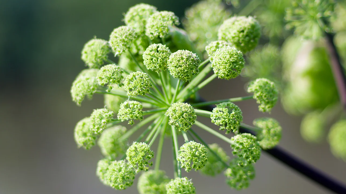
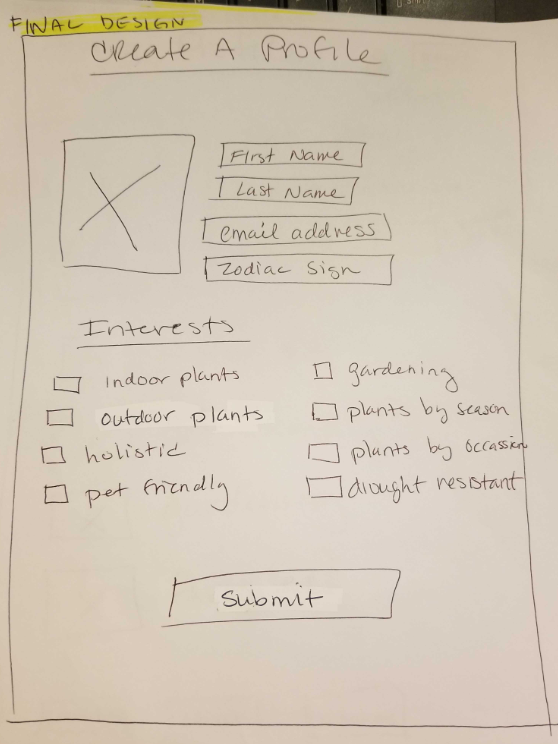
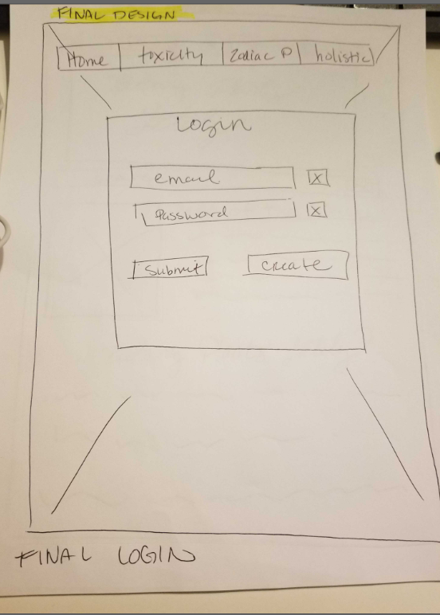
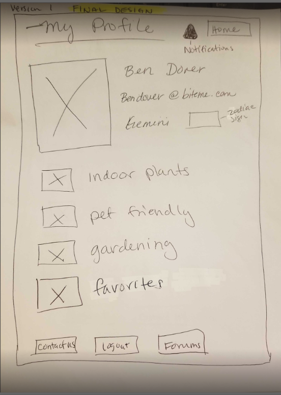

# Botany-Plants-Lately
**Botany-Plants-Lately** is an "online plant database" application built using HTML, CSS, JS, MySQL, Handlebars.js, Sequelize, Json, typescript, express and node.js.

The deployed repository can be found at the following URL:
"deployed heroku URL"

##User Story

Plants lovers and plant enthusiasts are able to search a plant database for identification, care and uses of their plants. The plant lover will be able to create and use a personal profile, to tailor their B.P.L (Botany Plants Lately) experience to thier interests and or needs. All of which will be accessable once the user has logged into their B.P.L profile. 

**As a plant lover**
*I would like to search for plants types, that fit my lifestyle, personal interests and or needs.*
   -SEARCH for the plant I have in my home, to correctly identify its species,   
    care needs, the toxicity level.
   -LEARN about the healing properties of hollistic plants
   -DISCOVER the plants that are best for me, based on my astrological sign.
 *I would like to save my profile, zodiac sign and personal plant interests*
   -SAVE my profile info i.e username, email address and zodiac sign
   -SELECT which plant subjects interest me (indoor, outdoor, gardening, herbology, toxicity or hollistic) 
 
 ![Gif of the functionality of the deployed website.]
 (./assets/media/images/"{{gif url}}"
 
 ### Wireframes
  Paper wireframes have been included, to show the conceptual design of the webiste. Giving the basic layout and functionality.
  
  
  
  
 
  ##Features
  
  Features of the deployed application and repository are as follows:

  ###THIRD PARTY APIs
   Trefle | The plants API
   Trefle is a botanical API and data source.
       *http://trefle.io/

  ##TECHNOLOGY USED
    *HTML 
    *CSS 
    *JS 
    *MySQL
    *Handlebars.js
    *Seqealize
    *Json 
    *typescript
    *express 
    *node.js
    *Bootstrap
    *Bcrypt
 
  ##NEW TECHNOLOGY (NOT COVERED IN CLASS)
  *TypeScript

  ##INSTALLATION OF THE REPO
  A copy of the repository can be cloned at https://github.com/cam1024/Botany-plants-lately. Simply click on the repo and select **Clone**. From the drop down menu select the copy icon. Type (directly into your terminal):
  *'git clone' + 'the repo link' + enter.

  ##FUTURE ITERATIONS
  *FORUMS- We would like to implement a forum that will allow users to collaborate with like mind individuals. Where they can ask questions, share their experiences or simply make friends with fellow plant lovers.
  
  ##CREDITS

  **Collaborators**
  Marie Pacheco github: https://github.com/Lycanchic
  Roger Kinney github: https://github.com/RogerAKinney
  Cameron Duran github: https://github.com/cam1024
  Milo Ellsworth github: https://github.com/saitek300
  Kenan Mesic github: https://github.com/kenanmesic

