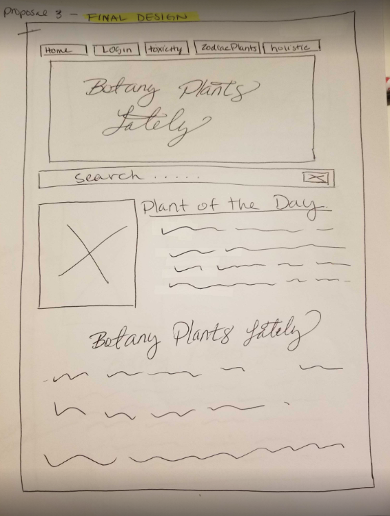

# Botany-Plants-Lately
**Botany-Plants-Lately** is an "online plant database" application built using HTML, CSS, JS, MySQL, Handlebars, Json, typescript and node.js.

! (image of deployed app)

The deployed repository can be found at the following URL:
"{{deployed heroku URL"

##User Story

Plants lovers and plant enthusiasts are able to search for plant identification, care and uses. The plant lover will be able to create and use a personal profile, to tailor their B.P.L (Botany Plants Lately) experience to thier interests and or needs. All of which will be accessable once the user has logged into their B.P.L profile. 

**As a plant lover**
*I would like to search for plants types, that fit my lifestyle, personal interests and or needs.*
   -SEARCH for the plant I have online and matching the plant I have to the plant photo online, to       correclty identify the plant.
   -LEARN about the care, needs and uses of the plants
   -LEARN if there are any hollistic or toxicity properties of the plant
   -LEARN about the healing properties of hollistic plants
   -LEARN about the plants that are best for me, based on my astrological sign.
 *I would like to save my profile, zodiac sign and personal plant interests*
   -SAVE my profile info i.e username, email address and zodiac sign
   -SELECT which plant subjects interest me (indoor, outdoor, gardening, herbology, toxicity or           hollistic) 
 ![Gif of the functionality of the deployed website.]
 (./assets/media/images/"{{gif url}}"
 
 ### Wireframes
  The paper wireframes have been included, to show the conceptual design of the webiste. Giving the basic layout and functionality of the webiste
  
  
  
  
  (./assets/media/images/images"{{images of the wireframing}}"
  
  ##Features
  
  Features of the deployed applicatin and repository 
